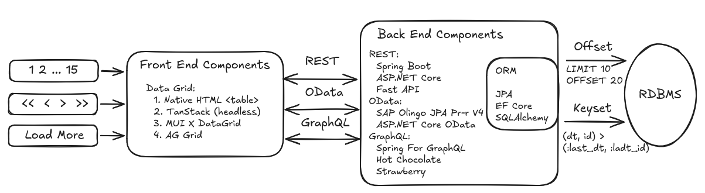

# Обзор


Три основных типа навигации в таблицах на UI:
- номера страниц;
- кнопки "первая", "назад", "вперед", "последняя";
- "загрузить ещё" или бесконечная прокрутка.

Действия пользователя преобразуются в запросы к БД с пагинацией двух видов:
- **Offset pagination (scan)** `LIMIT 10 OFFSET 20`; может быть неэффективной при глубокой пагинации.
- **Keyset pagination (seek)** `WHERE (created_dt, id) > (:last_created_dt, :last_id)`; использует значения полей последней загруженной строки.

На уровне **API** пагинацию на основе **Keyset** обычно называют **Cursor (opaque cursor) pagination**. Frontend не формирует курсор самостоятельно, а получает его от сервера в виде непрозрачной строки, например, `nextCursor` или `nextRef`.

Разные типы навигации на UI могут обслуживаться разными видами пагинации на уровне БД:
| навигация ↓ / пагинация → | Offset (scan) | Cursor / Keyset (seek) |
|---|:-:|:-:|
| Номера страниц | ✓ | ✗ |
| Первая / назад / вперед / последняя | ✓ | Частично |
| Загрузить ещё | ✓ | ✓ |

Основные модели взаимодействия frontend-компонентов с backend-компонентами:
- **REST API**, API, построенный поверх **HTTP** в соответствии с архитектурными принципами **REST**. Разработчик самостоятельно определяет структуру ресурсов, назначение параметров и формат ответа.
- **OData (Open Data Protocol)**, стандарт поверх **REST**, который определяет язык запросов к данным, формат ответа, описание схемы и поддерживаемых возможностей.
- **GraphQL**, типизированный язык запросов к **API** на основе схемы. Клиент самостоятельно определяет структуру необходимых данных, но только в рамках опубликованной сервером схемы.

Для backend используются:
- **фреймворки** для реализации **RESTful API**;
- **реализации OData**;
- **GraphQL-серверы** для выполнения запросов;
- **ORM** для взаимодействия с реляционными БД.

Для трёх популярных платформ актуален следующий набор:
| Платформа | REST | OData | GraphQL | ORM |
|---|---|---|---|---|
| **JVM** | Spring MVC | SAP Olingo JPA Processor V4 | Spring for GraphQL | Hibernate |
| **.NET** | ASP.NET Core | ASP.NET Core OData | Hot Chocolate | EF Core |
| **Python** | FastAPI | нет поддержки | Strawberry | SQLAlchemy |

Часто используемые способы отображения таблиц на Web Frontend (React):
- **Native HTML**, реализация без использования дополнительных библиотек;
- **TanStack Table (headless)**, headless-библиотека без встроенного UI, предоставляющая только логику работы с таблицами (сортировка, фильтрация и т.д.);
- **MUI X DataGrid**, полноценный компонент таблицы с готовым UI, разделённый на *Community* и *Enterprise* версии;
- **AG Grid**, полноценный компонент с расширенными возможностями.

Для небольших таблиц может использоваться **client-side pagination** (выполняется в памяти браузера над уже загруженными данными), а для больших таблиц **server-side pagination** (данные запрашиваются порциями через API).

# Пример взаимодействия с backend
В **PostgreSQL** создана и заполнена данными такая БД. Backend реализован на **.NET**.
```
┌─────────────────────────────┐                    ┌───────────────────────────────┐
│           customers         │─────<────────┐     |            orders             │
├─────────────────────────────┤              |     ├───────────────────────────────┤
│ PK  id          BIGINT      │              |     │ PK  id            BIGINT      │
│     name        VARCHAR     │              |     │     status        VARCHAR     │
│     country     VARCHAR     │              |     │     total_amount  NUMERIC     │
│     created_at  TIMESTAMPTZ │              |     │     created_at    TIMESTAMPTZ │
└─────────────────────────────┘              └─────│ FK  customer_id   BIGINT      │
                                                   └───────────────────────────────┘
```
## REST
Запрос данных по **GET**:
```bash
curl 'http://localhost:8080/api/orders?page=0&size=3&sort=id,asc'
```
Содержание результата:
```json
{
  "items": [
    { "id": 1, "status": "NEW",     "total": 50.00,  "createdAt": "2026-01-01T00:00:00Z", "customerName": "Acme GmbH" },
    { "id": 2, "status": "PAID",    "total": 87.00,  "createdAt": "2026-01-01T01:00:00Z", "customerName": "Globex SARL" },
    { "id": 3, "status": "SHIPPED", "total": 124.00, "createdAt": "2026-01-01T02:00:00Z", "customerName": "Initech Ltd" }
  ],
  "page": 0, "size": 3, "totalCount": 60, "totalPages": 20, "hasNext": true, "hasPrev": false
}
```
Описание сервиса во формате **OpenAPI** такое:
```yaml
openapi: 3.1.0
info:
  title: Prototype common REST contract
  version: "3.0"
  description: 'Common offset-paged endpoint, identical across the java/dotnet/python backends; pagination and sorting only.'
servers:
  - url: /
paths:
  /api/orders:
    get:
      summary: One page of orders
      parameters:
        - name: size
          in: query
          required: false
          description: Rows per page.
          schema: { type: integer, default: 20, minimum: 1, maximum: 200 }
        - name: sort
          in: query
          required: false
          description: '`field[,dir]`; field `id`/`createdAt`/`total`, dir `asc`/`desc` (default `asc`), `id` as tiebreaker.'
          schema: { type: string, default: "id,asc" }
        - name: page
          in: query
          required: false
          description: 0-based page index.
          schema: { type: integer, default: 0, minimum: 0 }
      responses:
        "200":
          description: A page of orders.
          content:
            application/json:
              schema: { $ref: "#/components/schemas/OffsetPage" }
        "400":
          description: 'Invalid or empty `sort`/`size`/`page` — rejected, not defaulted.'
          content:
            application/json:
              schema: { $ref: "#/components/schemas/Error" }
components:
  schemas:
    OrderItem:
      type: object
      required: [id, status, total, createdAt, customerName]
      properties:
        id: { type: integer, format: int64, example: 1 }
        status: { type: string, example: "PAID" }
        total: { type: number, example: 100.50 }
        createdAt: { type: string, format: date-time, example: "2026-01-01T10:00:00Z" }
        customerName: { type: string, example: "Acme GmbH" }
    OffsetPage:
      type: object
      required: [items, page, size, totalCount, totalPages, hasNext, hasPrev]
      properties:
        items:
          type: array
          items: { $ref: "#/components/schemas/OrderItem" }
        page: { type: integer, example: 0 }
        size: { type: integer, example: 20 }
        totalCount: { type: integer, format: int64, example: 60 }
        totalPages: { type: integer, example: 3 }
        hasNext: { type: boolean, example: true }
        hasPrev: { type: boolean, example: false }
    Error:
      type: object
      required: [error]
      properties:
        error: { type: string, example: "unknown sort field 'name'" }
```

## OData
Описание содержания сервиса можно получить так:
```bash
curl 'http://localhost:8080/odata/'
```
```json
{
  "@odata.context": "http://localhost:8080/odata/$metadata",
  "value": [
    { "name": "Orders",    "kind": "EntitySet", "url": "Orders" },
    { "name": "Customers", "kind": "EntitySet", "url": "Customers" }
  ]
}
```
Можно запросить детальную метаинформацию, включая связи между таблицами:
```bash
curl 'http://localhost:8080/odata/$metadata'
```
```xml
<?xml version="1.0" encoding="utf-8"?>
<edmx:Edmx xmlns:edmx="http://docs.oasis-open.org/odata/ns/edmx" Version="4.0">
  <edmx:DataServices>
    <Schema xmlns="http://docs.oasis-open.org/odata/ns/edm" Namespace="BackendDotnet">
      <EntityType Name="Order">
        <Key><PropertyRef Name="Id"/></Key>
        <Property Name="Id" Type="Edm.Int64" Nullable="false"/>
        <Property Name="Status" Type="Edm.String" Nullable="false"/>
        <Property Name="Total" Type="Edm.Decimal" Nullable="false" Scale="Variable"/>
        <Property Name="CreatedAt" Type="Edm.DateTimeOffset" Nullable="false"/>
        <Property Name="CustomerId" Type="Edm.Int64" Nullable="false"/>
        <NavigationProperty Name="Customer" Type="BackendDotnet.Customer" Nullable="false">
          <ReferentialConstraint Property="CustomerId" ReferencedProperty="Id"/>
        </NavigationProperty>
      </EntityType>
      <EntityType Name="Customer">
        <Key><PropertyRef Name="Id"/></Key>
        <Property Name="Id" Type="Edm.Int64" Nullable="false"/>
        <Property Name="Name" Type="Edm.String" Nullable="false"/>
        <Property Name="Country" Type="Edm.String" Nullable="false"/>
        <Property Name="CreatedAt" Type="Edm.DateTimeOffset" Nullable="false"/>
      </EntityType>
    </Schema>
    <Schema xmlns="http://docs.oasis-open.org/odata/ns/edm" Namespace="Default">
      <EntityContainer Name="Container">
        <EntitySet Name="Orders" EntityType="BackendDotnet.Order">
          <NavigationPropertyBinding Path="Customer" Target="Customers"/>
        </EntitySet>
        <EntitySet Name="Customers" EntityType="BackendDotnet.Customer"/>
      </EntityContainer>
    </Schema>
  </edmx:DataServices>
</edmx:Edmx>
```
**`$top` + `$count`**:
```bash
curl 'http://localhost:8080/odata/Orders?$top=2&$count=true'
```
```json
{
  "@odata.context": "http://localhost:8080/odata/$metadata#Orders",
  "@odata.count": 60,
  "value": [
    { "Id": 1, "Status": "NEW",  "Total": 50.00, "CreatedAt": "2026-01-01T00:00:00Z", "CustomerId": 1 },
    { "Id": 2, "Status": "PAID", "Total": 87.00, "CreatedAt": "2026-01-01T01:00:00Z", "CustomerId": 2 }
  ]
}
```
  
**проекция (выбор нужных полей) `$select`**:
```bash
curl 'http://localhost:8080/odata/Orders?$top=2&$select=Id,Status,Total'
```
```json
{
  "@odata.context": "http://localhost:8080/odata/$metadata#Orders(Id,Status,Total)",
  "value": [
    { "Id": 1, "Status": "NEW",  "Total": 50.00 },
    { "Id": 2, "Status": "PAID", "Total": 87.00 }
  ]
}
```  
**Фильтрация `$filter`**:
```bash
curl 'http://localhost:8080/odata/Orders?$filter=Status%20eq%20%27PAID%27&$select=Id,Status&$top=3&$count=true'
```
```json
{
  "@odata.context": "http://localhost:8080/odata/$metadata#Orders(Id,Status)",
  "@odata.count": 15,
  "value": [
    { "Id": 2,  "Status": "PAID" },
    { "Id": 6,  "Status": "PAID" },
    { "Id": 10, "Status": "PAID" }
  ]
}
```
**сортировка `$orderby`**:
```bash
curl 'http://localhost:8080/odata/Orders?$orderby=Total%20desc&$select=Id,Total&$top=3'
```
```json
{
  "@odata.context": "http://localhost:8080/odata/$metadata#Orders(Id,Total)",
  "value": [
    { "Id": 52, "Total": 987.00 },
    { "Id": 26, "Total": 975.00 },
    { "Id": 51, "Total": 950.00 }
  ]
}
```
**связь с другими таблицами `$expand`**:
```bash
curl 'http://localhost:8080/odata/Orders?$top=1&$expand=Customer'
```
```json
{
  "@odata.context": "http://localhost:8080/odata/$metadata#Orders(Customer())",
  "value": [
    {
      "Id": 1, "Status": "NEW", "Total": 50.00, "CreatedAt": "2026-01-01T00:00:00Z", "CustomerId": 1,
      "Customer": { "Id": 1, "Name": "Acme GmbH", "Country": "DE", "CreatedAt": "2026-01-01T00:00:00Z" }
    }
  ]
}
```

## GraphQL

Запросы к схеме, чтобы выяснить содержание сервисов:
```bash
curl -s http://localhost:8080/graphql \
  -H 'Content-Type: application/json' \
  -d '{"query":"{ __type(name:\"Query\"){ fields{ name args{ name } type{ name kind } } } }"}'
```
```json
{
  "data": {
    "__type": {
      "fields": [
        {
          "name": "orders",
          "args": [
            { "name": "status" }, { "name": "first" }, { "name": "after" },
            { "name": "last" }, { "name": "before" }
          ],
          "type": { "name": "OrdersConnection", "kind": "OBJECT" }
        }
      ]
    }
  }
}
```
```bash
curl -s http://localhost:8080/graphql \
  -H 'Content-Type: application/json' \
  -d '{"query":"{ __type(name:\"OrderItemDto\"){ name kind fields{ name type{ kind ofType{ name } } } } }"}'
```
```json
{
  "data": {
    "__type": {
      "name": "OrderItemDto",
      "kind": "OBJECT",
      "fields": [
        { "name": "id",           "type": { "kind": "NON_NULL", "ofType": { "name": "Long" } } },
        { "name": "status",       "type": { "kind": "NON_NULL", "ofType": { "name": "String" } } },
        { "name": "total",        "type": { "kind": "NON_NULL", "ofType": { "name": "Decimal" } } },
        { "name": "createdAt",    "type": { "kind": "NON_NULL", "ofType": { "name": "DateTime" } } },
        { "name": "customerName", "type": { "kind": "NON_NULL", "ofType": { "name": "String" } } }
      ]
    }
  }
}
```
Первые две записи:
```bash
curl -s http://localhost:8080/graphql \
  -H 'Content-Type: application/json' \
  -d '{"query":"{ orders(first:2){ edges{ cursor node{ id status total createdAt customerName } } pageInfo{ hasNextPage endCursor } } }"}'
```
```json
{
  "data": {
    "orders": {
      "edges": [
        { "cursor": "MA==", "node": { "id": 1, "status": "NEW",  "total": 50.00, "createdAt": "2026-01-01T00:00:00.000Z", "customerName": "Acme GmbH" } },
        { "cursor": "MQ==", "node": { "id": 2, "status": "PAID", "total": 87.00, "createdAt": "2026-01-01T01:00:00.000Z", "customerName": "Globex SARL" } }
      ],
      "pageInfo": { "hasNextPage": true, "endCursor": "MQ==" }
    }
  }
}
```
Следующие:
```bash
curl -s http://localhost:8080/graphql \
  -H 'Content-Type: application/json' \
  -d '{"query":"{ orders(first:2, after:\"MQ==\"){ edges{ cursor node{ id } } pageInfo{ hasNextPage endCursor } } }"}'
```
```json
{
  "data": {
    "orders": {
      "edges": [
        { "cursor": "Mg==", "node": { "id": 3 } },
        { "cursor": "Mw==", "node": { "id": 4 } }
      ],
      "pageInfo": { "hasNextPage": true, "endCursor": "Mw==" }
    }
  }
}
```
Фильтрация:
```bash
curl -s http://localhost:8080/graphql \
  -H 'Content-Type: application/json' \
  -d '{"query":"{ orders(status:\"PAID\", first:3){ edges{ node{ id status } } pageInfo{ hasNextPage } } }"}'
```
```json
{
  "data": {
    "orders": {
      "edges": [
        { "node": { "id": 2,  "status": "PAID" } },
        { "node": { "id": 6,  "status": "PAID" } },
        { "node": { "id": 10, "status": "PAID" } }
      ],
      "pageInfo": { "hasNextPage": true }
    }
  }
}
```
